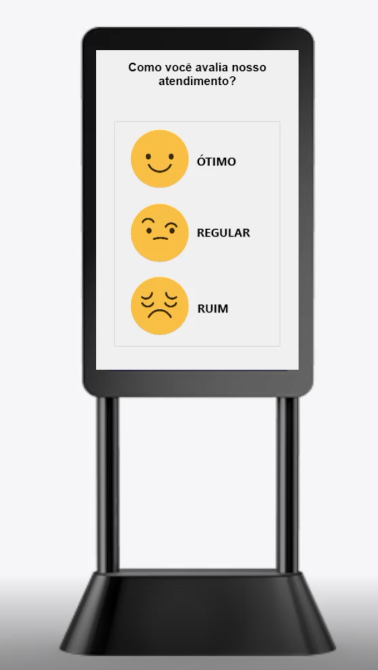

# Sistema para Pesquisa de satisfação
Portifólio - Sistema para registro de Pesquisa de Satisfação.

Sistema para avaliar o encantamento dos clientes. Usa SQLite e pode ser compilado para Android/IOS/Desktop. Fontes em Delphi.
Este recurso usado por grandes varejistas pode ser implantado em pequenas lojas com custo baixo para registrar o grau de satisfação dos clientes. 
Lojista pode usar seu próprio celular ou tablet (após compilado para esses sistemas)

** Gerado para portifólio pessoal. Sistema simples gerado para treinamento.
(Monstagem ilustrativa com tela do sistema)
